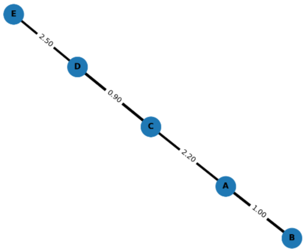
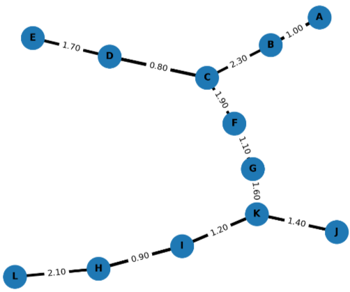
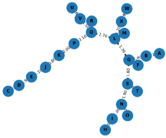
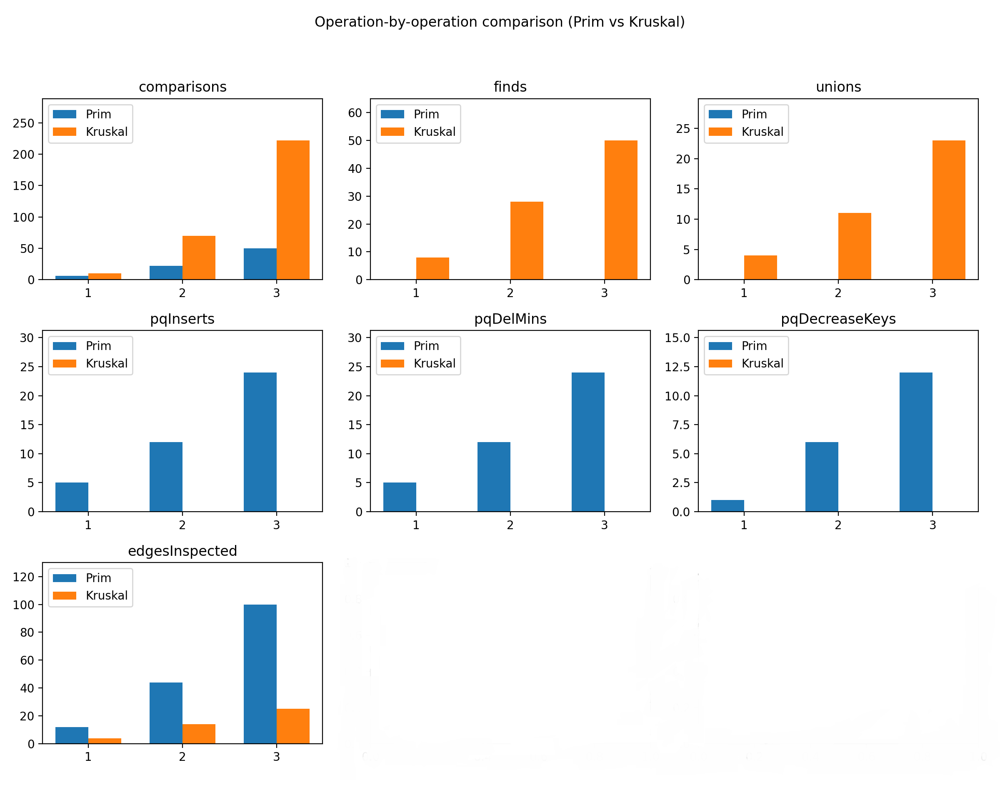

# Analytical report
## MST — Prim vs Kruskal
**Objective**

Apply Prim’s and Kruskal’s algorithms to find MSTs for several test graphs, and compare algorithmic efficiency and suitability under different conditions.
 
## 1.  A summary of input data and algorithm results

### Input
The input file *data/graphs.json* contains three graphs:

1.Graph 1 — Small

+ id: 1

+ description: Small graph (V=5, E=6)

+ V = 5, E = 6 (nodes A...E)

2.Graph 2 — Medium

+ id: 2

+ description: Medium graph (V=12, E=21)

+ V = 12, E = 21 (nodes A...L)

3.Graph 3 — Large

+ id: 3

+ description: Large graph (V=24, E=47)

+ V = 24, E = 47 (nodes A...X)

### Results

All metrics below are taken from the program output JSON produced by the runner.

| graph         | algorithm | V  | E  | timeMs   | comparisons | finds | unions | pqInserts | pqDelMins | pqDecreaseKeys | edgesInspected | mstWeight |
|---------------|-----------|----:|---:|---------:|------------:|------:|-------:|----------:|----------:|---------------:|---------------:|----------:|
| small_input   | Kruskal   |  5 |  6 |  1.1749  |         10  |     8 |      4 |         0 |         0 |              0 |              4 |  6.60    |
| small_input   | Prim      |  5 |  6 |  0.7074  |          6  |     0 |      0 |         5 |         5 |              1 |             12 |  6.60    |
| medium_input  | Kruskal   | 12 | 22 |  0.0437  |         70  |    28 |     11 |         0 |         0 |              0 |             14 | 16.00    |
| medium_input  | Prim      | 12 | 22 |  0.0304  |         22  |     0 |      0 |        12 |        12 |              6 |             44 | 16.00    |
| large_input   | Kruskal   | 24 | 50 |  0.1049  |        222  |    50 |     23 |         0 |         0 |              0 |             25 | 33.00    |
| large_input   | Prim      | 24 | 50 |  0.0550  |         50  |     0 |      0 |        24 |        24 |             12 |            100 | 33.00    |

**Correctness check**: total MST cost reported by both algorithms matches for each graph

## 2.   A comparison between Prim’s and Kruskal’s algorithms

### High-level difference

+ **Prim’s is vertex-based:** it grows a tree from a starting vertex using a priority queue to pick the least-cost edge from the current tree to outside. **Kruskal’s is edge-based:** it sorts all edges and adds them in increasing order, using a union-find to avoid cycles. 

### Theoretical complexity and typical trade-offs

+ **Time:** Kruskal’s running time is dominated by sorting the edges - O(ElogE). Prim’s can be O(V2) with a simple array or O((E+V)logV) using an indexed priority queue. Consequently, Prim’s is usually preferable for dense graphs, Kruskal’s often wins on sparse graphs. 

+ **Memory & data layout:** Kruskal’s works naturally on an edge list, Prim’s works naturally on adjacency structures and a priority queue. If edges can be sorted externally, Kruskal’s has an advantage. 

+ **Final result:** All classical MST algorithms produce MSTs with the same total minimum weight for the same input graph, they differ only in the steps they take.

### Observations from the runs:

+ Weights match for Prim and Kruskal across all graphs, as theory guarantees. 

+ Prim ran faster in all three cases in these experiments (notably on the large graph Prim ≈ 0.055 ms vs Kruskal ≈ 0.105 ms). That matches expectations when the implementation uses an efficient indexed priority queue and when the graph is not extremely sparse. The large comparisons count for Kruskal 222 reflects the cost of sorting and comparing many edges before union-find processing. 

+ Kruskal shows fewer edgesInspected in metrics for some graphs — because Kruskal’s main loop inspects edges in sorted order and early-terminates when the MST is complete. Prim inspects adjacency edges as it expands.

## 3. Conclusions

Short practical rules based on literature and results:

### Use Prim’s when:

+ The graph is dense or you store it as adjacency lists/matrix. With a binary or Fibonacci heap, Prim’s performs very well and avoids sorting all edges.

### Use Kruskal’s when:

+ The graph is sparse - edges << V2, or your input is naturally an edge list. Kruskal is also attractive when edges can be externally sorted and when an efficient union-find is available. 
GeeksforGeeks

### Implementation & input shape matter:

+ The same theoretical algorithm can produce different runtime behavior depending on data structures, overheads of sorting implementation, and how you count operations. The MST algorithms produce the same total weight but differ in process. 

## 4. References

[Marpaung, F., Arnita, Wirdatull J. “COMPERATIVE OF PRIM’S, KRUSKAL’S AND BORUVKA’S ALGORITMA TO SOLVE MINIMUM SPANNING TREE PROBLEMS”, Jurnal Handayani, Vol. 10 No. 2 (2019), pp. 80–89. 
](https://pdfs.semanticscholar.org/a96e/53069187abf0eb5109d3d9a3ace6b4979464.pdf)

[“Difference between Prim’s and Kruskal’s algorithm for MST”, GeeksforGeeks — article summarizing approach, data-structures and complexity trade-offs,Arghadip Chakraborty 12 Jul, 2025.
](https://www.geeksforgeeks.org/dsa/difference-between-prims-and-kruskals-algorithm-for-mst/)

